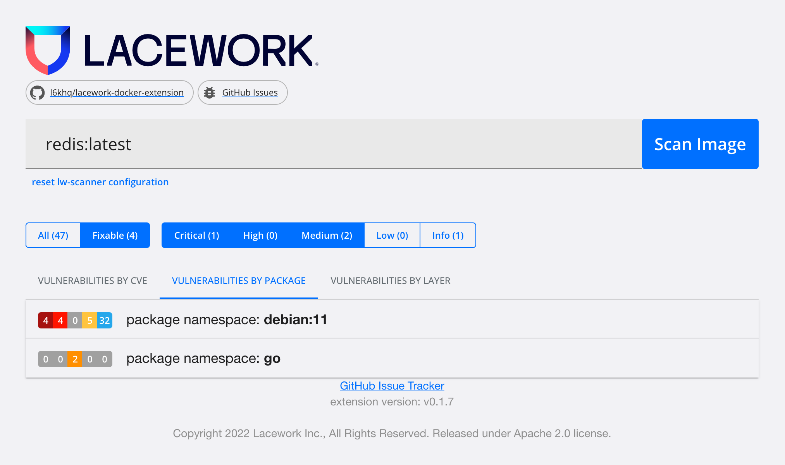

# Lacework Docker Extension

This is a public beta and released as open source.  This extension relies on `lw-scanner` which is automatically downloaded as part of the docker image build.  

To use this extension, an active Lacework subscription is required with access to a Lacework inline scanner token.

For any recommendations, suggestions, feature requests and issue, head over the the project's [GitHub Issues tracker](https://github.com/l6khq/lacework-docker-extension/issues).

## Enabling Docker Extensions

To install extensions not yet listed in the Docker Desktop extension market place, follow the instructions here [https://docs.docker.com/desktop/extensions-sdk/](https://docs.docker.com/desktop/extensions-sdk/#prerequisites)

## Installing the Lacework Docker extension

`docker extension install lacework/lacework-docker-extension:latest`

or, if the extension is already installed, you can easily upgrade with

`docker extension update lacework/lacework-docker-extension:latest`

## Build

To enable Honeycomb event logging, ensure the following are build arguments for the docker build.
- `HONEYCOMB_TEAM` api key for sending data to honeycomb
- `HONEYCOMB_DATASET` dataset for honeycomb

## Honeycomb Events

The image on docker hub collects the following metrics
- scanner version
- successful scan
(image names, or other identifying information is not collected)
